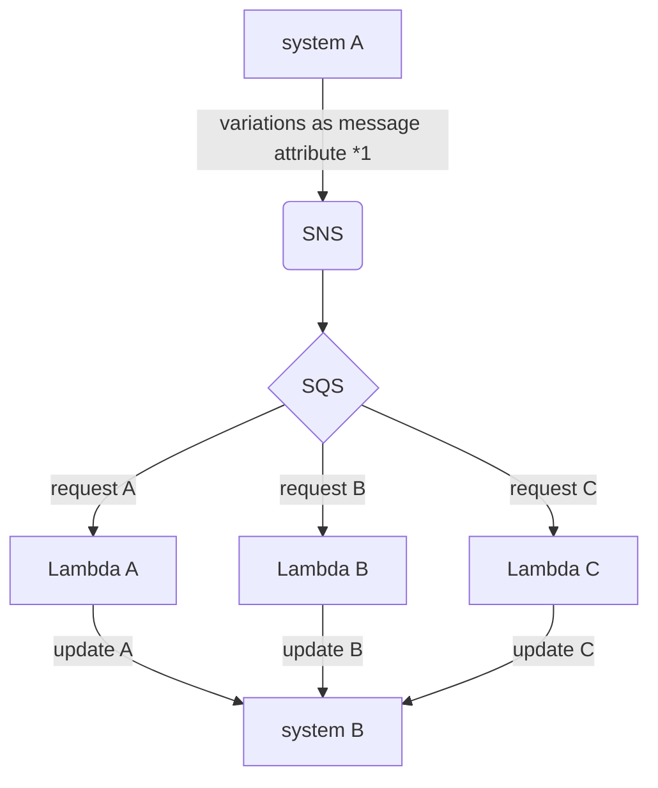
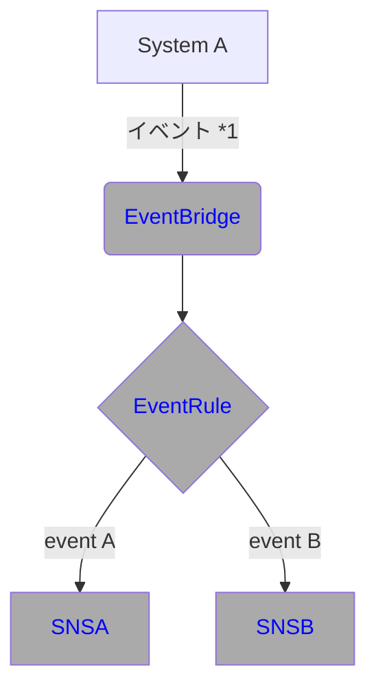
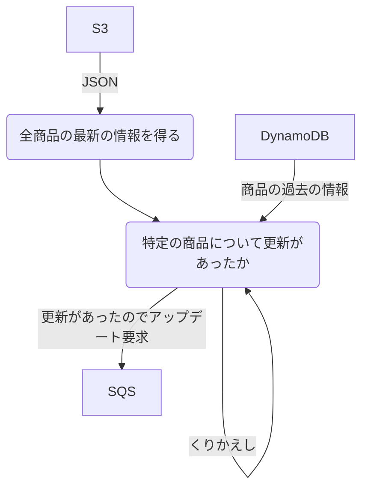

## これは何

[Githubでコードで図を書くことができる](https://github.blog/2022-02-14-include-diagrams-markdown-files-mermaid/)ので、それを使ったサンプルコードです。

自分の練習にも使います。

## 便利なツール

[Live Editor](https://mermaid-js.github.io/mermaid-live-editor/)

## Flow

## Flow

## Flow

