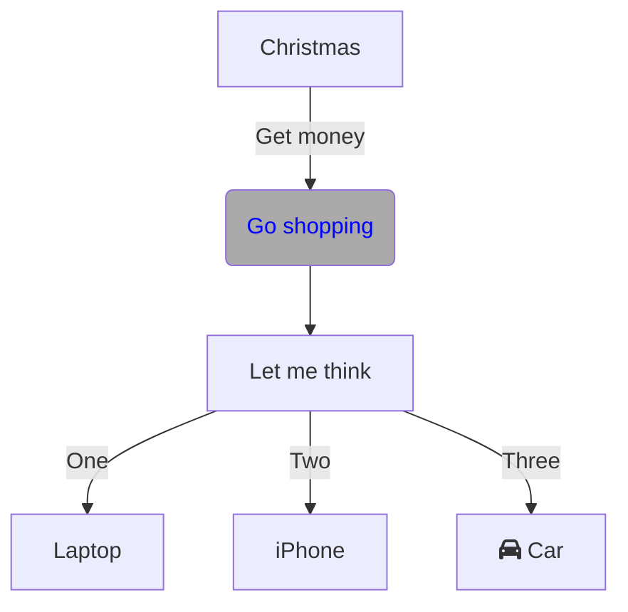

## これは何

Githubでコードで図を書くことができるので、それを使ったサンプルコードです。
https://github.blog/2022-02-14-include-diagrams-markdown-files-mermaid/

自分の練習にも使います。

## 便利なツール

(Live Editor)[https://mermaid-js.github.io/mermaid-live-editor/]

## Flow

## 
